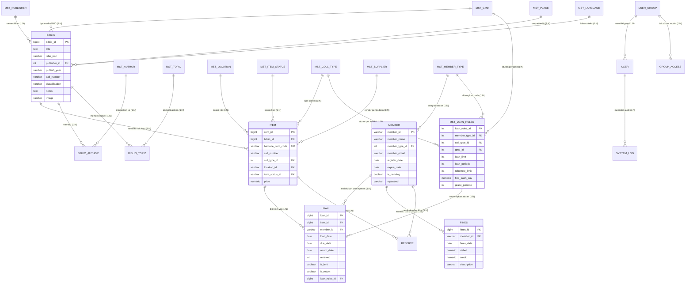
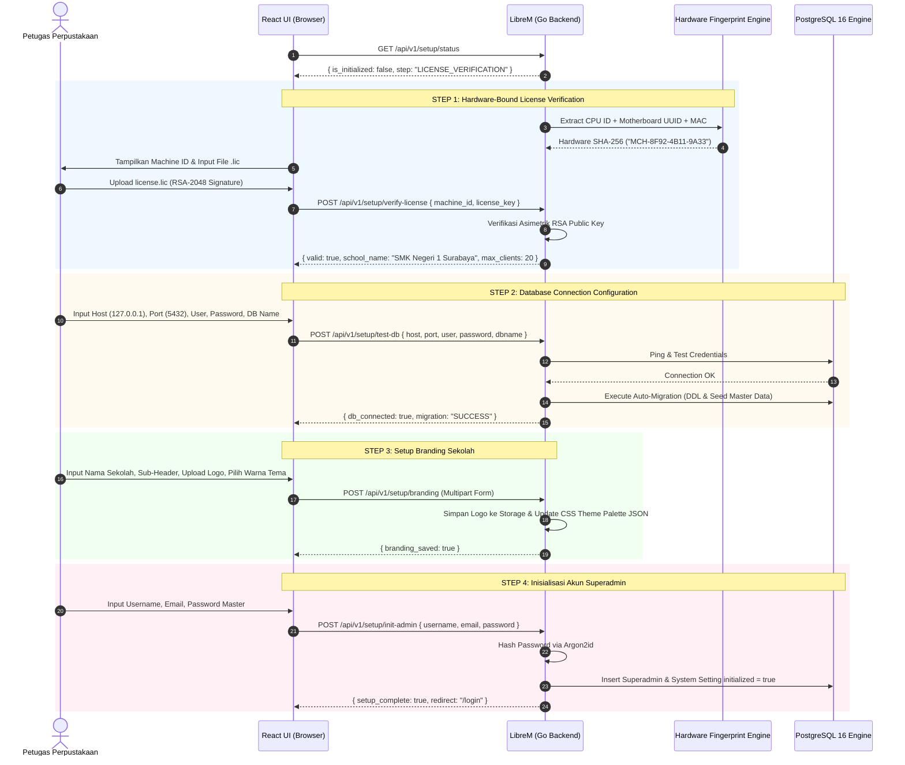

# TECHNICAL PRODUCT REQUIREMENT DOCUMENT (PRD) & SYSTEM ARCHITECTURE
## Re-Engineering SLiMS 9 Bulian ke Platform Modern "LibreM"

**Dokumen Versi:** 1.0.0  
**Status:** Architecture Blueprint & Implementation Ready  
**Role:** Lead Software Architect & Reverse-Engineering Expert  
**Target Platform:** LibreM (Go Fiber + Pure PostgreSQL + React Shadcn/ui Monorepo)

---

## DAFTAR ISI
1. [FASE 1: Reverse Engineering Database & Domain Analysis](#fase-1-reverse-engineering-database--domain-analysis)
   - 1.1 Analisis Arsitektur Legacy SLiMS 9 Bulian
   - 1.2 Entity Relationship Diagram (Mermaid.js)
   - 1.3 Pengelompokan Modul Domain
   - 1.4 Evaluasi Relasi Core: Biblio (Work/Metadata) vs Item (Exemplar/Physical Copy)
   - 1.5 Redesain Skema Database Pure PostgreSQL (DDL Lengkap & pg_trgm)
2. [FASE 2: Audit Business Logic & Circulation Rules](#fase-2-audit-business-logic--circulation-rules)
   - 2.1 Domain Logic: Aturan Peminjaman (Loan Rules & Hierarchy Precedence)
   - 2.2 Domain Logic: Aturan Pengembalian, Hari Libur & Formula Denda
   - 2.3 Domain Logic: Aturan Perpanjangan (Renewals)
   - 2.4 Domain Logic: Keanggotaan, Masa Berlaku & Blokir Finansial
   - 2.5 Pseudocode Agnostik (Circulation Engine)
3. [FASE 3: Technical PRD & Architecture Specification "LibreM"](#fase-3-technical-prd--architecture-specification-LibreM)
   - 3.1 Topologi Sistem, Arsitektur LAN Multi-User & Anti-Locking
   - 3.2 First-Run Wizard & Hardware-Bound Licensing (RSA Machine Signature)
   - 3.3 Spesifikasi Lengkap RESTful API Endpoints
   - 3.4 Single Executable Go:embed & Inno Setup GUI Installer
   - 3.5 Standar Monorepo Codebase & Directory Structure

---

# FASE 1: REVERSE ENGINEERING DATABASE & DOMAIN ANALYSIS

## 1.1 Analisis Arsitektur Legacy SLiMS 9 Bulian
Berdasarkan audit mendalam terhadap `install/senayan.sql`, `sysconfig.inc.php`, dan `config/`:
1. **Engine Storage Ketinggalan Zaman:** SLiMS menggunakan MySQL/MariaDB dengan engine `MyISAM` secara default. MyISAM tidak memiliki dukungan ACID transactions, foreign key constraints (relasi hanya ada di level aplikasi), dan sering mengalami *table corruption* saat PC server mati mendadak.
2. **Ketiadaan Referential Integrity:** 
   - `item.biblio_id` tidak memiliki `FOREIGN KEY REFERENCES biblio(biblio_id) ON DELETE CASCADE`.
   - String digunakan sebagai pseudo foreign-key: `loan.item_code` mereferensikan `item.item_code` (varchar 20), `loan.member_id` mereferensikan `member.member_id` (varchar 20), dan `item.location_id` mereferensikan `mst_location.location_id` (varchar 3). Jika `item_code` diedit, integritas data sirkulasi rusak.
3. **Penyimpanan Nilai Terserialisasi PHP:** Tabel `user.groups` dan `group_access.menus` menyimpan data PHP serialized array (`a:1:{i:0;s:1:"1";}`) bukan format standar JSON, menyulitkan interoperabilitas lintas bahasa.
4. **Denormalisasi Manual yang Berbahaya:** Tabel `loan_history` merupakan duplikasi historis yang diisi manual lewat PHP script saat sirkulasi selesai (`circulation_base_lib.inc.php`), berisiko inkonsistensi data ketika eksekusi PHP terputus di tengah jalan.
5. **Pencarian Legacy:** Full-Text Search MyISAM bergantung pada query `MATCH(...) AGAINST(...)` yang sensitif terhadap collation dan stopword MySQL, serta tidak memiliki indexing typo-tolerance.

---

## 1.2 Entity Relationship Diagram (ERD) Mermaid.js



---

## 1.3 Pengelompokan Modul Domain

| Modul Domain | Tabel Legacy SLiMS | Entitas LibreM (Postgres) | Deskripsi Fungsional |
|---|---|---|---|
| **Bibliografi (Cataloging)** | `biblio`, `biblio_author`, `mst_author`, `mst_publisher`, `mst_place`, `mst_gmd`, `mst_language`, `biblio_topic`, `mst_topic`, `biblio_attachment` | `biblios`, `authors`, `biblio_authors`, `publishers`, `places`, `gmds`, `languages`, `topics`, `biblio_attachments` | Mengelola data induk intelektual buku, jurnal, e-book, metadata MARC, klasifikasi DDC, dan subjek. |
| **Eksemplar (Physical Item)** | `item`, `mst_item_status`, `mst_location`, `mst_coll_type`, `mst_supplier` | `items`, `item_statuses`, `locations`, `collection_types`, `suppliers` | Mengelola aset fisik inventaris buku, nomor barcode unik, nomor panggil item, lokasi rak fisik, dan status pinjam/rusak. |
| **Keanggotaan (Patron)** | `member`, `mst_member_type`, `member_custom` | `members`, `member_types`, `member_custom_fields` | Manajemen identitas pemustaka (Siswa, Guru, Staf), masa aktif kartu, kuota pinjam, dan status aktif/suspend. |
| **Sirkulasi & Finansial** | `loan`, `loan_history`, `fines`, `mst_loan_rules`, `holiday`, `reserve` | `loans`, `fine_ledgers`, `loan_rules`, `holidays`, `reservations` | Transaksi checkout, checkin, perpanjangan, kalkulasi keterlambatan, ledger buku kas denda (debet/credit), dan booking buku. |
| **Keamanan & Sistem** | `user`, `user_group`, `group_access`, `system_log`, `setting` | `users`, `roles`, `role_permissions`, `audit_logs`, `system_settings` | Manajemen akun petugas perpustakaan, enkripsi Argon2id/Bcrypt, role-based access control (RBAC), dan audit log aktivitas. |

---

## 1.4 Evaluasi Relasi Core: Biblio (Data Induk Judul) vs Item (Fisik Eksemplar + Barcode)

Dalam sistem otomasi perpustakaan standar internasional (seperti FRBR - *Functional Requirements for Bibliographic Records*):
1. **Biblio (Work & Expression):** Mewakili karya konseptual intelektual. 
   - Contoh: Buku *"Laskar Pelangi"* karya Andrea Hirata, terbitan Bentang Pustaka, ISBN `978-979-1227-34-6`. Data ini hanya di-entry **satu kali** di sistem, apapun formatnya.
2. **Item (Manifestation & Item):** Mewakili objek fisik material aktual yang berada di rak perpustakaan.
   - Contoh: Perpustakaan membeli 5 eksemplar buku *"Laskar Pelangi"*. Maka akan terbentuk **1 record `biblio`** dan **5 record `item`**. Masing-masing memiliki stiker barcode fisik tersendiri (`B00001`, `B00002`, `B00003`, dst.).
3. **Kelemahan Legacy SLiMS yang Diperbaiki di LibreM:**
   - Di SLiMS, tabel `loan` menyimpan string `item_code`. Jika petugas salah menginput atau mengubah kode barcode fisik buku yang sedang dipinjam, relasi sirkulasi menjadi yatim (*orphan*).
   - Di **LibreM**, tabel `loans` menggunakan foreign key `item_id BIGINT REFERENCES items(id)` yang berstatus immutable dan diindeks secara kuat. Barcode `barcode` tetap unik pada tabel `items`.
   - Relasi bersifat One-to-Many (`biblio.id` 1 -> N `items.biblio_id`). Penghapusan data induk `biblio` dilarang secara ketat (`ON DELETE RESTRICT`) jika masih memiliki fisik kopi di tabel `items`.

---

## 1.5 Redesain Skema Pure PostgreSQL (DDL Lengkap)

Skema ini telah dimodernisasi:
- Tipe data MySQL `int(11)` / `auto_increment` ditransformasi ke `BIGSERIAL` / `BIGINT`.
- String datetime dimodernisasi ke `TIMESTAMPTZ` (Timezone-aware UTC).
- Kolom uang `int(11)` ditransformasi ke `NUMERIC(15,2)` dengan audit ledger ganda.
- Full-Text Search menggunakan kombinasi native **PostgreSQL `tsvector`** (dengan kamus bahasa) dan **`pg_trgm` GIN Index** untuk pencarian cepat, typo-tolerant, dan substring matching pada judul, pengarang, dan ISBN.

```sql
-- ============================================================================
-- EXTENSIONS & INITIAL SETUP
-- ============================================================================
CREATE EXTENSION IF NOT EXISTS "uuid-ossp";
CREATE EXTENSION IF NOT EXISTS "pg_trgm";
CREATE EXTENSION IF NOT EXISTS "unaccent";

-- ============================================================================
-- MODUL 1: MASTER REFERENCES & SYSTEM AUTH
-- ============================================================================
CREATE TABLE system_settings (
    setting_key VARCHAR(100) PRIMARY KEY,
    setting_value JSONB NOT NULL,
    description TEXT,
    updated_at TIMESTAMPTZ DEFAULT CURRENT_TIMESTAMP
);

CREATE TABLE roles (
    id SERIAL PRIMARY KEY,
    name VARCHAR(50) NOT NULL UNIQUE,
    description VARCHAR(255),
    created_at TIMESTAMPTZ DEFAULT CURRENT_TIMESTAMP
);

CREATE TABLE users (
    id BIGSERIAL PRIMARY KEY,
    username VARCHAR(50) NOT NULL UNIQUE,
    full_name VARCHAR(150) NOT NULL,
    email VARCHAR(150) NOT NULL UNIQUE,
    password_hash VARCHAR(255) NOT NULL,
    role_id INT NOT NULL REFERENCES roles(id) ON DELETE RESTRICT,
    is_active BOOLEAN NOT NULL DEFAULT TRUE,
    avatar_url VARCHAR(255),
    last_login_at TIMESTAMPTZ,
    last_login_ip VARCHAR(45),
    created_at TIMESTAMPTZ NOT NULL DEFAULT CURRENT_TIMESTAMP,
    updated_at TIMESTAMPTZ NOT NULL DEFAULT CURRENT_TIMESTAMP
);

CREATE TABLE role_permissions (
    role_id INT NOT NULL REFERENCES roles(id) ON DELETE CASCADE,
    resource VARCHAR(100) NOT NULL,
    can_read BOOLEAN NOT NULL DEFAULT FALSE,
    can_write BOOLEAN NOT NULL DEFAULT FALSE,
    can_delete BOOLEAN NOT NULL DEFAULT FALSE,
    PRIMARY KEY (role_id, resource)
);

CREATE TABLE system_logs (
    id BIGSERIAL PRIMARY KEY,
    user_id BIGINT REFERENCES users(id) ON DELETE SET NULL,
    log_type VARCHAR(30) NOT NULL DEFAULT 'STAFF',
    module VARCHAR(50) NOT NULL,
    action VARCHAR(50) NOT NULL,
    description TEXT NOT NULL,
    ip_address VARCHAR(45),
    created_at TIMESTAMPTZ NOT NULL DEFAULT CURRENT_TIMESTAMP
);

-- ============================================================================
-- MODUL 2: BIBLIOGRAFI & MASTER KATALOG
-- ============================================================================
CREATE TABLE mst_gmd (
    id SERIAL PRIMARY KEY,
    code VARCHAR(10) NOT NULL UNIQUE,
    name VARCHAR(100) NOT NULL UNIQUE
);

CREATE TABLE mst_publishers (
    id SERIAL PRIMARY KEY,
    name VARCHAR(200) NOT NULL UNIQUE
);

CREATE TABLE mst_places (
    id SERIAL PRIMARY KEY,
    name VARCHAR(150) NOT NULL UNIQUE
);

CREATE TABLE mst_languages (
    code CHAR(5) PRIMARY KEY,
    name VARCHAR(100) NOT NULL
);

CREATE TABLE mst_authors (
    id BIGSERIAL PRIMARY KEY,
    name VARCHAR(255) NOT NULL,
    authority_type VARCHAR(50) DEFAULT 'personal_name', -- personal, org, conference
    created_at TIMESTAMPTZ DEFAULT CURRENT_TIMESTAMP
);

CREATE TABLE mst_topics (
    id BIGSERIAL PRIMARY KEY,
    topic VARCHAR(150) NOT NULL UNIQUE,
    topic_type VARCHAR(50) DEFAULT 'topical'
);

CREATE TABLE biblios (
    id BIGSERIAL PRIMARY KEY,
    title TEXT NOT NULL,
    sor VARCHAR(255), -- Statement of Responsibility
    edition VARCHAR(50),
    isbn_issn VARCHAR(32),
    publisher_id INT REFERENCES mst_publishers(id) ON DELETE SET NULL,
    publish_place_id INT REFERENCES mst_places(id) ON DELETE SET NULL,
    publish_year VARCHAR(10),
    collation VARCHAR(100),
    series_title VARCHAR(255),
    call_number VARCHAR(100),
    language_code CHAR(5) REFERENCES mst_languages(code) ON DELETE SET NULL,
    classification VARCHAR(50),
    notes TEXT,
    cover_image VARCHAR(255),
    gmd_id INT REFERENCES mst_gmd(id) ON DELETE SET NULL,
    opac_hide BOOLEAN NOT NULL DEFAULT FALSE,
    promoted BOOLEAN NOT NULL DEFAULT FALSE,
    labels JSONB DEFAULT '[]'::jsonb,
    search_vector TSVECTOR,
    created_at TIMESTAMPTZ NOT NULL DEFAULT CURRENT_TIMESTAMP,
    updated_at TIMESTAMPTZ NOT NULL DEFAULT CURRENT_TIMESTAMP
);

CREATE TABLE biblio_authors (
    biblio_id BIGINT NOT NULL REFERENCES biblios(id) ON DELETE CASCADE,
    author_id BIGINT NOT NULL REFERENCES mst_authors(id) ON DELETE RESTRICT,
    level INT NOT NULL DEFAULT 1, -- 1 = Primary, 2 = Additional, 3 = Editor
    PRIMARY KEY (biblio_id, author_id)
);

CREATE TABLE biblio_topics (
    biblio_id BIGINT NOT NULL REFERENCES biblios(id) ON DELETE CASCADE,
    topic_id BIGINT NOT NULL REFERENCES mst_topics(id) ON DELETE RESTRICT,
    level INT NOT NULL DEFAULT 1,
    PRIMARY KEY (biblio_id, topic_id)
);

CREATE TABLE biblio_attachments (
    id BIGSERIAL PRIMARY KEY,
    biblio_id BIGINT NOT NULL REFERENCES biblios(id) ON DELETE CASCADE,
    file_name VARCHAR(255) NOT NULL,
    file_path VARCHAR(500) NOT NULL,
    file_size_bytes BIGINT NOT NULL,
    mime_type VARCHAR(100) NOT NULL,
    access_type VARCHAR(20) NOT NULL DEFAULT 'public', -- public, members_only, private
    created_at TIMESTAMPTZ DEFAULT CURRENT_TIMESTAMP
);

-- ============================================================================
-- MODUL 3: ITEM / EKSEMPLAR
-- ============================================================================
CREATE TABLE mst_locations (
    id VARCHAR(10) PRIMARY KEY,
    name VARCHAR(150) NOT NULL UNIQUE
);

CREATE TABLE mst_item_statuses (
    id VARCHAR(10) PRIMARY KEY,
    name VARCHAR(100) NOT NULL UNIQUE,
    no_loan BOOLEAN NOT NULL DEFAULT FALSE,
    skip_stock_take BOOLEAN NOT NULL DEFAULT FALSE
);

CREATE TABLE mst_coll_types (
    id SERIAL PRIMARY KEY,
    name VARCHAR(100) NOT NULL UNIQUE
);

CREATE TABLE items (
    id BIGSERIAL PRIMARY KEY,
    biblio_id BIGINT NOT NULL REFERENCES biblios(id) ON DELETE RESTRICT,
    barcode VARCHAR(50) NOT NULL UNIQUE,
    inventory_code VARCHAR(100),
    call_number VARCHAR(100),
    coll_type_id INT REFERENCES mst_coll_types(id) ON DELETE SET NULL,
    location_id VARCHAR(10) REFERENCES mst_locations(id) ON DELETE SET NULL,
    item_status_id VARCHAR(10) REFERENCES mst_item_statuses(id) ON DELETE SET NULL,
    received_date DATE,
    order_no VARCHAR(50),
    price NUMERIC(15,2) DEFAULT 0.00,
    source INT DEFAULT 0, -- 0: Pembelian, 1: Hibah, 2: Hadiah
    notes TEXT,
    created_at TIMESTAMPTZ NOT NULL DEFAULT CURRENT_TIMESTAMP,
    updated_at TIMESTAMPTZ NOT NULL DEFAULT CURRENT_TIMESTAMP
);

-- ============================================================================
-- MODUL 4: KEANGGOTAAN / PATRON
-- ============================================================================
CREATE TABLE mst_member_types (
    id SERIAL PRIMARY KEY,
    name VARCHAR(100) NOT NULL UNIQUE,
    loan_limit INT NOT NULL DEFAULT 3,
    loan_periode_days INT NOT NULL DEFAULT 7,
    reborrow_limit INT NOT NULL DEFAULT 1,
    fine_each_day NUMERIC(15,2) NOT NULL DEFAULT 1000.00,
    grace_periode_days INT NOT NULL DEFAULT 0,
    membership_duration_days INT NOT NULL DEFAULT 365,
    enable_reserve BOOLEAN NOT NULL DEFAULT TRUE,
    reserve_limit INT NOT NULL DEFAULT 2,
    created_at TIMESTAMPTZ DEFAULT CURRENT_TIMESTAMP,
    updated_at TIMESTAMPTZ DEFAULT CURRENT_TIMESTAMP
);

CREATE TABLE members (
    id VARCHAR(50) PRIMARY KEY, -- Nomor Anggota / NISN / NIP
    full_name VARCHAR(150) NOT NULL,
    gender CHAR(1) CHECK (gender IN ('M', 'F')),
    birth_date DATE,
    member_type_id INT NOT NULL REFERENCES mst_member_types(id) ON DELETE RESTRICT,
    address TEXT,
    email VARCHAR(150),
    phone VARCHAR(30),
    institution VARCHAR(150),
    avatar_url VARCHAR(255),
    password_hash VARCHAR(255),
    register_date DATE NOT NULL DEFAULT CURRENT_DATE,
    expire_date DATE NOT NULL,
    is_pending BOOLEAN NOT NULL DEFAULT FALSE,
    notes TEXT,
    created_at TIMESTAMPTZ NOT NULL DEFAULT CURRENT_TIMESTAMP,
    updated_at TIMESTAMPTZ NOT NULL DEFAULT CURRENT_TIMESTAMP
);

-- ============================================================================
-- MODUL 5: SIRKULASI, DENDA & HARI LIBUR
-- ============================================================================
CREATE TABLE holidays (
    id SERIAL PRIMARY KEY,
    day_name VARCHAR(10), -- 'Sun', 'Sat' for recurring weekly
    specific_date DATE,   -- Specific holiday date
    description VARCHAR(255) NOT NULL,
    is_recurring BOOLEAN DEFAULT FALSE,
    CONSTRAINT uq_holiday_rule UNIQUE (day_name, specific_date)
);

CREATE TABLE mst_loan_rules (
    id SERIAL PRIMARY KEY,
    member_type_id INT NOT NULL REFERENCES mst_member_types(id) ON DELETE CASCADE,
    coll_type_id INT REFERENCES mst_coll_types(id) ON DELETE CASCADE,
    gmd_id INT REFERENCES mst_gmd(id) ON DELETE CASCADE,
    loan_limit INT NOT NULL DEFAULT 3,
    loan_periode_days INT NOT NULL DEFAULT 7,
    reborrow_limit INT NOT NULL DEFAULT 1,
    fine_each_day NUMERIC(15,2) NOT NULL DEFAULT 1000.00,
    grace_periode_days INT NOT NULL DEFAULT 0,
    created_at TIMESTAMPTZ DEFAULT CURRENT_TIMESTAMP
);

CREATE TABLE loans (
    id BIGSERIAL PRIMARY KEY,
    item_id BIGINT NOT NULL REFERENCES items(id) ON DELETE RESTRICT,
    member_id VARCHAR(50) NOT NULL REFERENCES members(id) ON DELETE RESTRICT,
    loan_rules_id INT REFERENCES mst_loan_rules(id) ON DELETE SET NULL,
    loan_date DATE NOT NULL DEFAULT CURRENT_DATE,
    due_date DATE NOT NULL,
    actual_return_date DATE,
    renewed_count INT NOT NULL DEFAULT 0,
    is_lent BOOLEAN NOT NULL DEFAULT TRUE,
    is_return BOOLEAN NOT NULL DEFAULT FALSE,
    staff_user_id BIGINT REFERENCES users(id) ON DELETE SET NULL,
    created_at TIMESTAMPTZ NOT NULL DEFAULT CURRENT_TIMESTAMP,
    updated_at TIMESTAMPTZ NOT NULL DEFAULT CURRENT_TIMESTAMP
);

-- Ledger Akuntansi Denda (Double-Entry Debit/Credit)
CREATE TABLE fine_ledgers (
    id BIGSERIAL PRIMARY KEY,
    member_id VARCHAR(50) NOT NULL REFERENCES members(id) ON DELETE RESTRICT,
    loan_id BIGINT REFERENCES loans(id) ON DELETE SET NULL,
    transaction_date DATE NOT NULL DEFAULT CURRENT_DATE,
    debit NUMERIC(15,2) NOT NULL DEFAULT 0.00,  -- Nominal denda bertambah
    credit NUMERIC(15,2) NOT NULL DEFAULT 0.00, -- Nominal denda dibayarkan
    description VARCHAR(255) NOT NULL,
    staff_user_id BIGINT REFERENCES users(id) ON DELETE SET NULL,
    created_at TIMESTAMPTZ NOT NULL DEFAULT CURRENT_TIMESTAMP
);

CREATE TABLE reservations (
    id BIGSERIAL PRIMARY KEY,
    item_id BIGINT NOT NULL REFERENCES items(id) ON DELETE CASCADE,
    member_id VARCHAR(50) NOT NULL REFERENCES members(id) ON DELETE CASCADE,
    reserve_date DATE NOT NULL DEFAULT CURRENT_DATE,
    expire_date DATE NOT NULL,
    status VARCHAR(20) NOT NULL DEFAULT 'PENDING', -- PENDING, FULFILLED, EXPIRED, CANCELLED
    created_at TIMESTAMPTZ DEFAULT CURRENT_TIMESTAMP
);

-- ============================================================================
-- INDEXES UNTUK HIGH-PERFORMANCE & PG_TRGM SEARCH
-- ============================================================================
-- 1. Indexing Sirkulasi & Status Aktif
CREATE INDEX idx_loans_active ON loans (item_id) WHERE is_return = FALSE;
CREATE INDEX idx_loans_member_active ON loans (member_id) WHERE is_return = FALSE;
CREATE INDEX idx_loans_due_date ON loans (due_date) WHERE is_return = FALSE;
CREATE INDEX idx_items_barcode ON items (barcode);
CREATE INDEX idx_members_name ON members (full_name);

-- 2. Trigram Indexes (pg_trgm GIN) untuk Typo-Tolerance & Substring Search
CREATE INDEX idx_trgm_biblio_title ON biblios USING gin (title gin_trgm_ops);
CREATE INDEX idx_trgm_biblio_isbn ON biblios USING gin (isbn_issn gin_trgm_ops);
CREATE INDEX idx_trgm_author_name ON mst_authors USING gin (name gin_trgm_ops);

-- 3. Full-Text Search Trigger (tsvector)
CREATE OR REPLACE FUNCTION update_biblio_search_vector() RETURNS trigger AS $$
BEGIN
    NEW.search_vector :=
        setweight(to_tsvector('indonesian', coalesce(NEW.title, '')), 'A') ||
        setweight(to_tsvector('indonesian', coalesce(NEW.series_title, '')), 'B') ||
        setweight(to_tsvector('simple', coalesce(NEW.isbn_issn, '')), 'A') ||
        setweight(to_tsvector('indonesian', coalesce(NEW.call_number, '')), 'C') ||
        setweight(to_tsvector('indonesian', coalesce(NEW.notes, '')), 'D');
    RETURN NEW;
END
$$ LANGUAGE plpgsql;

CREATE TRIGGER trg_biblio_search_update
BEFORE INSERT OR UPDATE ON biblios
FOR EACH ROW EXECUTE FUNCTION update_biblio_search_vector();

CREATE INDEX idx_biblio_search_fts ON biblios USING gin (search_vector);
```

---

# FASE 2: AUDIT BUSINESS LOGIC & RULES

Berdasarkan audit file `admin/modules/circulation/circulation_base_lib.inc.php`, `admin/modules/circulation/circulation_action.php`, dan `admin/modules/membership/member_base_lib.inc.php`:

## 2.1 Domain Logic: Aturan Peminjaman (Loan Rules)
1. **Validitas Member:**
   - Member harus terdaftar di tabel `members`.
   - `is_pending == true` -> Transaksi dibatalkan (Error: `MEMBER_BLOCKED_PENDING`).
   - `CURRENT_DATE > expire_date` -> Transaksi dibatalkan (Error: `MEMBERSHIP_EXPIRED`).
   - Tunggakan denda: `SUM(debit) - SUM(credit) > MAX_FINE_ALLOWED` -> Transaksi ditolak sampai denda diselesaikan.
2. **Ketersediaan Eksemplar (Item Availability):**
   - Barcode item harus ditemukan di database.
   - Pengecekan status ketersediaan aktif: `SELECT count(*) FROM loans WHERE item_id = :id AND is_return = FALSE`. Jika > 0 -> Error `ITEM_ALREADY_ON_LOAN`.
   - Cek `mst_item_statuses.no_loan`: jika bernilai `TRUE` (misal status "Hanya Baca di Tempat", "Rusak", atau "Hilang") -> Error `ITEM_LOAN_FORBIDDEN`.
   - Cek Reservasi: Jika item sedang dibooking oleh anggota lain (`reserve.member_id != current_member`), peminjaman ditolak -> Error `ITEM_RESERVED_BY_OTHER`.
3. **Resolusi Hierarki Aturan Peminjaman (*Loan Rule Precedence*):**
   SLiMS memiliki hierarki bertingkat untuk menentukan batas kuota dan hari pinjam. Prioritas pencarian aturan di `mst_loan_rules`:
   - **Level 1 (Paling Spesifik):** Cocokkan `member_type_id` + `coll_type_id` + `gmd_id`.
   - **Level 2 (Koleksi):** Cocokkan `member_type_id` + `coll_type_id` (GMD kosong).
   - **Level 3 (Media/GMD):** Cocokkan `member_type_id` + `gmd_id` (Koleksi kosong).
   - **Level 4 (Default Fallback):** Jika ketiga kombinasi di atas tidak ditemukan, ambil aturan default langsung dari master kategori anggota: `mst_member_types`.
4. **Validasi Kuota Peminjaman (*Loan Limit*):**
   - Hitung total buku yang sedang dipinjam (`CURRENT_LOANS`) + buku di session keranjang (`SESSION_LOANS`).
   - Jika `(CURRENT_LOANS + SESSION_LOANS) >= loan_limit` -> Tolak dengan error `LOAN_LIMIT_EXCEEDED`.
5. **Kalkulasi Tanggal Jatuh Tempo (*Due Date*):**
   - Formula awal: `due_date = loan_date + loan_periode_days`.
   - Penyesuaian Hari Libur: Lakukan looping cek tanggal. Jika `due_date` jatuh pada hari libur mingguan (contoh: hari Minggu) atau ada di tabel `holidays`, geser `due_date = due_date + 1 day` sampai menemukan hari kerja aktif.
   - Pagar Batas Keanggotaan: Jika hasil perhitungan `due_date > member.expire_date`, maka paksa `due_date = member.expire_date`.

---

## 2.2 Domain Logic: Aturan Pengembalian & Perhitungan Denda (Return & Fine Rules)
1. **Deteksi Keterlambatan:**
   - Kondisi terlambat: `actual_return_date > due_date`.
   - `raw_overdue_days = actual_return_date - due_date`.
2. **Penanganan Hari Libur dalam Denda (`ignore_holidays_fine_calc`):**
   - Jika konfigurasi sistem mengaktifkan `ignore_holidays_fine_calc = TRUE`, hitung total hari libur resmi dan akhir pekan yang berada di antara `due_date` dan `actual_return_date`:
     $$\text{net\_overdue\_days} = \text{raw\_overdue\_days} - \text{count\_holidays(due\_date, actual\_return\_date)}$$
   - Jika `net_overdue_days <= 0`, maka dianggap tidak terlambat.
3. **Masa Tenggang (*Grace Period*):**
   - Tipe anggota atau aturan pinjam dapat memiliki `grace_periode_days` (contoh: 2 hari).
   - Jika `net_overdue_days <= grace_periode_days`, denda = Rp 0 (diberikan toleransi keterlambatan tanpa sanksi).
   - Jika `net_overdue_days > grace_periode_days`, denda dihitung penuh untuk seluruh hari keterlambatan:
     $$\text{Total Fine} = \text{net\_overdue\_days} \times \text{fine\_each\_day}$$
4. **Pencatatan Finansial Otomatis:**
   - Jika Total Fine > 0, sistem mengeksekusi insert ke tabel `fine_ledgers`:
     - `debit = Total Fine`
     - `credit = 0`
     - `description = "Denda keterlambatan item [BARCODE] selama [N] hari"`

---

## 2.3 Domain Logic: Aturan Perpanjangan (Renewals)
1. **Validasi Perpanjangan:**
   - Cek `renewed_count` pada record pinjaman. Jika `renewed_count >= reborrow_limit` -> Tolak: `RENEWAL_LIMIT_EXCEEDED`.
   - Cek reservasi: Jika item telah di-reserve oleh pemustaka lain -> Tolak: `CANNOT_RENEW_ITEM_RESERVED`.
   - Cek tunggakan: Jika tanggal sekarang sudah melampaui `due_date` lama, anggota wajib melunasi denda keterlambatan berjalan terlebih dahulu sebelum perpanjangan diizinkan.
2. **Eksekusi Perpanjangan:**
   - Kembalikan transaksi lama atau update record:
     - `renewed_count = renewed_count + 1`
     - `loan_date = CURRENT_DATE`
     - `due_date = calculate_due_date(CURRENT_DATE, loan_periode_days)`

---

## 2.4 Pseudocode Agnostik Sirkulasi (Language-Agnostic)

```text
STRUCT LoanContext:
    memberId: String
    barcode: String
    staffUserId: Int

FUNCTION ProcessCheckout(ctx: LoanContext) -> Result<LoanRecord, Error>:
    BEGIN TRANSACTION

    // 1. Validasi Pemustaka
    member = DB.FindMember(ctx.memberId)
    IF member IS NULL THEN ROLLBACK AND RETURN Error("MEMBER_NOT_FOUND")
    IF member.is_pending == TRUE THEN ROLLBACK AND RETURN Error("MEMBER_SUSPENDED")
    IF CURRENT_DATE > member.expire_date THEN ROLLBACK AND RETURN Error("MEMBERSHIP_EXPIRED")

    // Cek Saldo Hutang Denda
    outstandingDebt = DB.QueryScalar(
        "SELECT COALESCE(SUM(debit) - SUM(credit), 0) FROM fine_ledgers WHERE member_id = ?", 
        member.id
    )
    IF outstandingDebt > SYSTEM_MAX_ALLOWED_DEBT THEN
        ROLLBACK AND RETURN Error("MEMBER_HAS_UNPAID_FINES: Rp " + outstandingDebt)

    // 2. Validasi Eksemplar Fisik
    item = DB.FindItemByBarcode(ctx.barcode)
    IF item IS NULL THEN ROLLBACK AND RETURN Error("ITEM_NOT_FOUND")
    IF item.status.no_loan == TRUE THEN ROLLBACK AND RETURN Error("ITEM_STATUS_FORBIDS_LOAN")

    isItemLent = DB.Exists("SELECT 1 FROM loans WHERE item_id = ? AND is_return = FALSE FOR UPDATE", item.id)
    IF isItemLent THEN ROLLBACK AND RETURN Error("ITEM_ALREADY_BORROWED")

    isReservedByOther = DB.Exists(
        "SELECT 1 FROM reservations WHERE item_id = ? AND member_id != ? AND status = 'PENDING'", 
        item.id, member.id
    )
    IF isReservedByOther THEN ROLLBACK AND RETURN Error("ITEM_RESERVED_BY_ANOTHER_MEMBER")

    // 3. Resolusi Aturan Pinjam (Hierarchical Precedence)
    rule = DB.FindLoanRule(member.member_type_id, item.coll_type_id, item.biblio.gmd_id)
    IF rule IS NULL THEN
        rule = DB.FindLoanRule(member.member_type_id, item.coll_type_id, NULL)
    IF rule IS NULL THEN
        rule = DB.FindLoanRule(member.member_type_id, NULL, item.biblio.gmd_id)
    IF rule IS NULL THEN
        rule = DB.FindMemberTypeDefaultRule(member.member_type_id)

    // 4. Cek Kuota Pinjam
    activeLoanCount = DB.Count("SELECT count(*) FROM loans WHERE member_id = ? AND is_return = FALSE", member.id)
    IF activeLoanCount >= rule.loan_limit THEN
        ROLLBACK AND RETURN Error("LOAN_LIMIT_EXCEEDED: Max " + rule.loan_limit)

    // 5. Hitung Tanggal Jatuh Tempo
    candidateDueDate = CURRENT_DATE + Days(rule.loan_periode_days)
    WHILE IsHolidayOrWeekend(candidateDueDate):
        candidateDueDate = candidateDueDate + Days(1)

    IF candidateDueDate > member.expire_date THEN
        candidateDueDate = member.expire_date

    // 6. Simpan Transaksi Pinjam
    loan = DB.InsertLoan({
        item_id: item.id,
        member_id: member.id,
        loan_rules_id: rule.id,
        loan_date: CURRENT_DATE,
        due_date: candidateDueDate,
        staff_user_id: ctx.staffUserId,
        is_lent: TRUE,
        is_return: FALSE
    })

    // Selesaikan reservasi jika ada
    DB.Execute("UPDATE reservations SET status = 'FULFILLED' WHERE item_id = ? AND member_id = ?", item.id, member.id)

    COMMIT TRANSACTION
    RETURN Success(loan)


FUNCTION ProcessReturn(barcode: String, staffUserId: Int) -> Result<ReturnSummary, Error>:
    BEGIN TRANSACTION

    item = DB.FindItemByBarcode(barcode)
    IF item IS NULL THEN ROLLBACK AND RETURN Error("ITEM_NOT_FOUND")

    loan = DB.FindOne("SELECT * FROM loans WHERE item_id = ? AND is_return = FALSE FOR UPDATE", item.id)
    IF loan IS NULL THEN ROLLBACK AND RETURN Error("NO_ACTIVE_LOAN_FOR_ITEM")

    rule = DB.GetRule(loan.loan_rules_id)
    returnDate = CURRENT_DATE
    fineAmount = 0.0
    overdueDays = 0

    IF returnDate > loan.due_date THEN
        rawDays = (returnDate - loan.due_date).Days()
        
        IF CONFIG.ignore_holidays_fine_calc == TRUE THEN
            holidaysBetween = DB.CountHolidaysBetween(loan.due_date, returnDate)
            overdueDays = MAX(0, rawDays - holidaysBetween)
        ELSE
            overdueDays = rawDays

        IF overdueDays > rule.grace_periode_days THEN
            fineAmount = overdueDays * rule.fine_each_day
            
            // Catat ke Buku Kas Denda
            DB.InsertFineLedger({
                member_id: loan.member_id,
                loan_id: loan.id,
                transaction_date: returnDate,
                debit: fineAmount,
                credit: 0.0,
                description: Format("Denda keterlambatan item {0} ({1} hari)", barcode, overdueDays),
                staff_user_id: staffUserId
            })

    // Update Status Pengembalian
    DB.Execute("UPDATE loans SET is_return = TRUE, actual_return_date = ?, updated_at = NOW() WHERE id = ?", returnDate, loan.id)

    COMMIT TRANSACTION
    RETURN Success({
        loanId: loan.id,
        itemBarcode: barcode,
        overdueDays: overdueDays,
        fineAmount: fineAmount
    })
```

---

# FASE 3: TECHNICAL PRD & ARCHITECTURE SPECIFICATION ("LibreM")

## 3.1 Topologi Sistem, Arsitektur LAN Multi-User & Anti-Locking

### Arsitektur Konkurensi LAN Sekolah
Perpustakaan sekolah pada umumnya memiliki **1 PC Server Utama** (di meja sirkulasi atau ruang server) dan **5-10 PC Klien Petugas** (PC Pengatalogan, PC Peminjaman 1, PC Pengembalian, PC Petugas Referensi, serta Kios OPAC Mandiri).

```
[ LAN Sekolah: 192.168.1.0/24 atau Wi-Fi Perpustakaan ]
                                │
   ┌────────────────────────────┼───────────────────────────┐
   │                            │                           │
┌──────────────┐         ┌──────────────┐            ┌──────────────┐
│ Klien 1      │         │ Klien 2      │            │ Klien 3      │
│ (Petugas 1)  │         │ (Petugas 2)  │            │ (OPAC Siswa) │
│ Browser      │         │ Browser      │            │ Tablet/PC    │
│ 192.168.1.15 │         │ 192.168.1.20 │            │ 192.168.1.55 │
└──────┬───────┘         └──────┬───────┘            └──────┬───────┘
       │                        │                           │
       └────────────────────────┼───────────────────────────┘
                                │ HTTP REST API & Web UI (:8080)
                                ▼
         ┌──────────────────────────────────────────────┐
         │              PC SERVER UTAMA                 │
         │  IP Host: 0.0.0.0 (LAN IP: 192.168.1.10)     │
         │                                              │
         │  ┌────────────────────────────────────────┐  │
         │  │ LibreM Core (Single Go Binary)   │  │
         │  │ ├─ Port :8080 Listener (Fiber v2)      │  │
         │  │ ├─ Embedded Frontend (/dist via embed) │  │
         │  │ ├─ RESTful Endpoints                   │  │
         │  │ └─ Hardware License Validator          │  │
         │  └───────────────────┬────────────────────┘  │
         │                      │ pgxpool Connection    │
         │                      │ (Max 50 Conns, ACID)  │
         │                      ▼                       │
         │  ┌────────────────────────────────────────┐  │
         │  │ PostgreSQL 16 Service (Localhost:5432) │  │
         │  │ ├─ MVCC Engine (No Table Locks)        │  │
         │  │ ├─ pg_trgm & tsvector Indexes          │  │
         │  │ └─ Write-Ahead Logging (Crash Safe)    │  │
         │  └────────────────────────────────────────┘  │
         └──────────────────────────────────────────────┘
```

### Penanganan Masalah Database Locking & Solusi PostgreSQL
- **Mengapa SLiMS / SQLite Mengalami Locking:** 
  Pada SQLite atau database berbasis file, saat satu user melakukan operasi tulis (misal simpan katalog buku), seluruh database mengalami *exclusive file-lock*. Petugas lain yang menekan tombol *Sirkulasi* akan mengalami freeze / timeout `Database is locked`. Pada MySQL MyISAM, terjadi *table-level locking*.
- **Solusi Pure PostgreSQL di LibreM:**
  1. **MVCC (Multi-Version Concurrency Control):** Pembaca (*readers*) tidak pernah memblokir penulis (*writers*), dan penulis tidak pernah memblokir pembaca.
  2. **Row-Level Locking:** Operasi sirkulasi buku `item A` hanya mengunci satu baris pada tabel `items` menggunakan `SELECT ... FOR UPDATE`, sedangkan 10 petugas lain dapat meminjamkan `item B`, `item C`, menginput katalog, atau membuka OPAC tanpa hambatan sama sekali.
  3. **High-Performance Connection Pooling (`pgxpool`):** Backend Go mengelola connection pool persisten (Min 5, Max 50 koneksi), menjaga latensi query rata-rata di bawah 4 milidetik di jaringan LAN lokal.
  4. **Bind IP Address 0.0.0.0:** Server backend Go mengikat socket jaringan ke `0.0.0.0:8080`, sehingga otomatis dapat diakses oleh IP localhost server itu sendiri maupun oleh seluruh subnet Wi-Fi/LAN sekolah (`http://192.168.1.10:8080`).

---

## 3.2 First-Run Setup & Hardware-Bound License Wizard Workflow

Saat pertama kali diinstal di PC Perpustakaan, aplikasi otomatis masuk ke **Setup Wizard Mode** jika konfigurasi awal belum terdeteksi.



### Detail Algoritma Hardware Fingerprint (Go)
```go
// Menghasilkan Machine ID unik yang terikat pada fisik mesin PC Server
func GenerateMachineID() (string, error) {
    // 1. Ekstrak Motherboard Serial via WMI (Windows) / sysfs (Linux)
    mbSerial := getMotherboardUUID()
    // 2. Ekstrak CPU Processor ID
    cpuID := getCPUID()
    // 3. Gabungkan dan Hashing
    rawPayload := fmt.Sprintf("LibreM:%s:%s", mbSerial, cpuID)
    hasher := sha256.New()
    hasher.Write([]byte(rawPayload))
    hashBytes := hasher.Sum(nil)
    
    // Format: PE-XXXX-XXXX-XXXX-XXXX
    encoded := strings.ToUpper(hex.EncodeToString(hashBytes[:8]))
    return fmt.Sprintf("PE-%s-%s", encoded[:4], encoded[4:]), nil
}
```

---

## 3.3 Spesifikasi Lengkap RESTful API Endpoints

Semua endpoint dilindungi oleh JWT Middleware (`Authorization: Bearer <TOKEN>`), kecuali endpoint auth publik, katalog OPAC, dan setup wizard.

### 1. Setup Wizard & Licensing API
- **`GET /api/v1/setup/status`**
  - Response `200 OK`:
    ```json
    {
      "is_initialized": false,
      "machine_id": "PE-8F92-4B11",
      "required_step": "LICENSE_VERIFICATION"
    }
    ```
- **`POST /api/v1/setup/verify-license`**
  - Request:
    ```json
    {
      "license_token": "eyJhbGciOiJSUzI1NiIsInR5cCI6..."
    }
    ```
  - Response `200 OK`:
    ```json
    {
      "status": "VALID",
      "licensee": "SMA Negeri 1 Jakarta",
      "max_lan_nodes": 15,
      "expires_at": "2029-12-31T23:59:59Z"
    }
    ```
- **`POST /api/v1/setup/configure-db`**
  - Request:
    ```json
    {
      "host": "localhost",
      "port": 5432,
      "user": "postgres",
      "password": "SecretPassword123!",
      "database": "LibreM_db",
      "ssl_mode": "disable"
    }
    ```
- **`POST /api/v1/setup/branding`** (Multipart Form: `name`, `sub_name`, `theme_color_hex`, `logo_file`)
- **`POST /api/v1/setup/init-superadmin`**
  - Request: `{"username": "admin", "full_name": "Kepala Perpustakaan", "email": "perpus@sekolah.sch.id", "password": "SuperAdminPassword2026!"}`

---

### 2. Autentikasi & Profile Petugas
- **`POST /api/v1/auth/login`**
  - Request:
    ```json
    {
      "username": "petugas1",
      "password": "passwordPetugas123"
    }
    ```
  - Response `200 OK`:
    ```json
    {
      "token": "eyJhbGciOiJIUzI1NiIsIn...",
      "expires_in": 28800,
      "user": {
        "id": 2,
        "username": "petugas1",
        "full_name": "Siti Rahmawati, S.Pd",
        "role": "LIBRARIAN",
        "permissions": ["CIRCULATION_RW", "CATALOGING_RW"]
      }
    }
    ```
- **`GET /api/v1/auth/me`**
  - Response: Profil pengguna aktif saat ini beserta hak akses modul.

---

### 3. Modul Katalogisasi (Biblio & Item)
- **`GET /api/v1/catalog/biblios`** (Support FTS & pg_trgm fuzzy matching)
  - Query Params: `?q=laskar+pelangi&page=1&limit=20&classification=800`
  - Response `200 OK`:
    ```json
    {
      "data": [
        {
          "id": 1042,
          "title": "Laskar Pelangi",
          "authors": [{"id": 15, "name": "Andrea Hirata", "level": 1}],
          "isbn_issn": "978-979-1227-34-6",
          "publisher": "Bentang Pustaka",
          "publish_year": "2005",
          "call_number": "813 HIR l",
          "total_items": 5,
          "available_items": 3,
          "cover_url": "/uploads/covers/laskar_pelangi.jpg"
        }
      ],
      "meta": { "total_records": 1, "page": 1, "total_pages": 1 }
    }
    ```
- **`POST /api/v1/catalog/biblios`**
  - Request:
    ```json
    {
      "title": "Struktur Data & Algoritma dengan Golang",
      "sor": "Budi Raharjo",
      "isbn_issn": "978-602-6232-25-1",
      "publisher_id": 4,
      "publish_place_id": 2,
      "publish_year": "2024",
      "call_number": "005.1 BUD s",
      "classification": "005.1",
      "language_code": "id",
      "gmd_id": 1,
      "author_ids": [12, 18],
      "topic_ids": [5, 9],
      "notes": "Buku panduan praktis pemrograman sistem."
    }
    ```
- **`POST /api/v1/catalog/biblios/:id/items`** (Generate Barcode Fisik Otomatis)
  - Request:
    ```json
    {
      "barcode_prefix": "B",
      "quantity": 3,
      "coll_type_id": 1,
      "location_id": "RAK-01",
      "price": 125000.00
    }
    ```
  - Response `201 Created`:
    ```json
    {
      "generated_items": [
        { "id": 501, "barcode": "B000101", "location": "RAK-01" },
        { "id": 502, "barcode": "B000102", "location": "RAK-01" },
        { "id": 503, "barcode": "B000103", "location": "RAK-01" }
      ]
    }
    ```

---

### 4. Modul Keanggotaan (Patron)
- **`GET /api/v1/members/:id`**
  - Response `200 OK`:
    ```json
    {
      "id": "NISN-202409001",
      "full_name": "Ahmad Dani",
      "member_type": { "id": 1, "name": "Siswa Reguler", "loan_limit": 3 },
      "email": "ahmad.dani@sekolah.sch.id",
      "register_date": "2024-07-15",
      "expire_date": "2027-07-15",
      "is_expired": false,
      "is_pending": false,
      "active_loans_count": 1,
      "unpaid_fine_balance": 0.00
    }
    ```
- **`POST /api/v1/members`**
  - Request: Data pendaftaran anggota baru (identitas, tipe, masa berlaku).

---

### 5. Modul Sirkulasi (Circulation & Fines)
- **`POST /api/v1/circulation/checkout`**
  - Request:
    ```json
    {
      "member_id": "NISN-202409001",
      "barcode": "B000101"
    }
    ```
  - Response `200 OK`:
    ```json
    {
      "loan_id": 892,
      "item_barcode": "B000101",
      "title": "Struktur Data & Algoritma dengan Golang",
      "loan_date": "2026-10-01",
      "due_date": "2026-10-08",
      "member": { "id": "NISN-202409001", "name": "Ahmad Dani" }
    }
    ```
- **`POST /api/v1/circulation/checkin`** (Quick Return / Sirkulasi Balik)
  - Request:
    ```json
    {
      "barcode": "B000101"
    }
    ```
  - Response `200 OK`:
    ```json
    {
      "loan_id": 892,
      "item_barcode": "B000101",
      "title": "Struktur Data & Algoritma dengan Golang",
      "return_date": "2026-10-12",
      "due_date": "2026-10-08",
      "overdue_days": 4,
      "fine_amount": 4000.00,
      "fine_ledger_id": 128
    }
    ```
- **`POST /api/v1/circulation/renew/:loan_id`** (Perpanjangan Peminjaman)
  - Response: Tanggal jatuh tempo baru yang telah diekstensi sesuai aturan.
- **`POST /api/v1/fines/pay`** (Pembayaran Tagihan Denda Kasir)
  - Request:
    ```json
    {
      "member_id": "NISN-202409001",
      "amount_paid": 4000.00,
      "description": "Pembayaran lunas denda keterlambatan buku B000101"
    }
    ```
  - Response `200 OK`:
    ```json
    {
      "receipt_no": "REC-202610-0042",
      "member_id": "NISN-202409001",
      "amount_paid": 4000.00,
      "remaining_balance": 0.00,
      "timestamp": "2026-10-12T09:14:22Z"
    }
    ```

---

### 6. Laporan & Statistik Dashboard
- **`GET /api/v1/reports/summary`**
  - Response: Statistik ringkas harian (buku dipinjam hari ini, pengembalian, total denda terhimpun, buku terfavorit).

---

## 3.4 Single Executable Go:embed & Inno Setup GUI Installer

### Mekanisme Single Executable via `go:embed`
Frontend React dibangun menjadi aset web statis murni (`index.html`, `.js`, `.css`) di folder `frontend/dist/`. Go 1.16+ menyertakan fitur native `embed.FS` yang mengkompilasi seluruh file frontend tersebut langsung ke dalam file binary `.exe`.

```go
package main

import (
    "embed"
    "io/fs"
    "net/http"
    "github.com/gofiber/fiber/v2"
    "github.com/gofiber/fiber/v2/middleware/filesystem"
)

//go:embed frontend/dist/*
var embeddedFrontend embed.FS

func setupFrontendRouter(app *fiber.App) {
    distFS, err := fs.Sub(embeddedFrontend, "frontend/dist")
    if err != nil {
        panic(err)
    }

    // Serve aset frontend statis langsung dari RAM memory binary
    app.Use("/", filesystem.New(filesystem.Config{
        Root:         http.FS(distFS),
        Index:        "index.html",
        NotFoundFile: "index.html", // SPA Client-Side Routing Fallback
    }))
}
```

### Inno Setup Script (.iss) untuk Windows Installer Komersial
Script ini menciptakan installer mandiri (`LibreM_Setup_v1.0.exe`) yang melakukan:
1. Meminta direktori instalasi (Default `C:\Program Files\LibreM`).
2. Menyetujui EULA / Kontrak Lisensi Perangkat Lunak Perpustakaan.
3. Menjalankan instalasi PostgreSQL 16 Portable / Silent Service secara otomatis jika belum ada.
4. Mendaftarkan `LibreM.exe` sebagai Windows Service latar belakang (auto-start saat PC menyala).
5. Membuat desktop shortcut & icon di Start Menu.

```pascal
[Setup]
AppName=LibreM
AppVersion=1.0.0
AppPublisher=PT Perpus Inovasi Indonesia
DefaultDirName={autopf}\LibreM
DefaultGroupName=LibreM
OutputDir=..\installer_output
OutputBaseFilename=LibreM_Installer_v1.0
Compression=lzma2/ultra
SolidCompression=yes
SetupIconFile=assets\app_icon.ico
PrivilegesRequired=admin

[Files]
Source: "bin\LibreM.exe"; DestDir: "{app}"; Flags: ignoreversion
Source: "assets\*"; DestDir: "{app}\assets"; Flags: recursesubdirs
Source: "redist\postgresql-16-setup.exe"; DestDir: "{tmp}"; Flags: deleteafterinstall

[Icons]
Name: "{group}\LibreM Server"; Filename: "{app}\LibreM.exe"
Name: "{group}\Buka Aplikasi di Browser"; Filename: "http://localhost:8080"
Name: "{autodesktop}\LibreM"; Filename: "http://localhost:8080"; IconFilename: "{app}\assets\app_icon.ico"

[Run]
; Silent Install PostgreSQL jika diperlukan
Filename: "{tmp}\postgresql-16-setup.exe"; Parameters: "--mode unattended --superpassword ""PostgresPassword2026!"""; StatusMsg: "Memasang Engine Database PostgreSQL..."; Flags: runhidden
; Daftarkan Windows Service LibreM
Filename: "{app}\LibreM.exe"; Parameters: "--service install"; StatusMsg: "Mendaftarkan Windows Service..."; Flags: runhidden
Filename: "{app}\LibreM.exe"; Parameters: "--service start"; StatusMsg: "Menjalankan Layanan LibreM..."; Flags: runhidden
Filename: "http://localhost:8080"; Description: "Luncurkan Dashboard LibreM"; Flags: postinstall shellexec
```

---

## 3.5 Standar Monorepo Codebase & Directory Structure

```
LibreM/
├── .github/                      # CI/CD Workflows (Build Windows .exe & Inno Setup)
├── build/                        # Script build & template Inno Setup (.iss)
│   └── installer.iss
├── cmd/
│   └── server/
│       └── main.go               # Entry point aplikasi backend & bootstrap
├── config/                       # Pengaturan sistem, env loader, database config
│   ├── config.go
│   └── database.go
├── internal/                     # Private application logic (Clean Architecture)
│   ├── domain/                   # Domain entities & interface contracts
│   │   ├── biblio.go
│   │   ├── item.go
│   │   ├── member.go
│   │   ├── circulation.go
│   │   ├── user.go
│   │   └── license.go
│   ├── repository/               # Data Access Object murni PostgreSQL (pgx / GORM)
│   │   ├── postgres/
│   │   │   ├── biblio_repo.go
│   │   │   ├── item_repo.go
│   │   │   ├── member_repo.go
│   │   │   ├── circulation_repo.go
│   │   │   └── user_repo.go
│   │   └── migrations/           # SQL migration files (.sql)
│   │       ├── 000001_init_schema.up.sql
│   │       └── 000001_init_schema.down.sql
│   ├── service/                  # Business Logic Engine & Validation
│   │   ├── circulation_service.go# Kalkulator denda, hari libur, due date
│   │   ├── catalog_service.go    # FTS & Trigram query builder
│   │   ├── member_service.go
│   │   └── license_service.go    # Hardware fingerprint & RSA validator
│   ├── handler/                  # HTTP Delivery Controllers (Fiber v2 Handlers)
│   │   ├── auth_handler.go
│   │   ├── catalog_handler.go
│   │   ├── circulation_handler.go
│   │   ├── member_handler.go
│   │   └── setup_handler.go
│   └── middleware/               # Auth JWT, LAN CORS, Logging & Recovery
│       ├── jwt_auth.go
│       └── lan_cors.go
├── frontend/                     # Modern Frontend (React + Vite + Shadcn/ui)
│   ├── public/
│   ├── src/
│   │   ├── components/           # Shadcn/ui atomic components
│   │   │   ├── ui/               # button, input, dialog, table, card
│   │   │   ├── layout/           # Sidebar, Navbar, LAN Status Indicator
│   │   │   └── shared/           # Barcode scanner input listener, Receipt modal
│   │   ├── pages/                # Page views
│   │   │   ├── setup/            # 4-Step First-Run Wizard Pages
│   │   │   ├── dashboard/        # SaaS-like analytics dashboard
│   │   │   ├── catalog/          # Biblio & Item management
│   │   │   ├── circulation/      # Rapid checkout/checkin desk
│   │   │   └── members/          # Member directory & card print
│   │   ├── hooks/                # Custom React hooks (useCirculation, useAuth)
│   │   ├── lib/                  # Axios instance, CSS Variable theme injector
│   │   ├── App.tsx
│   │   └── main.tsx
│   ├── package.json
│   ├── tailwind.config.js
│   └── vite.config.ts
├── embed.go                      # File deklarasi go:embed frontend/dist
├── go.mod
├── go.sum
└── README.md
```

---

# FASE 4: UI/UX ARCHITECTURE & DESIGN SYSTEM (SHADCN/UI SLiMS BULIAN EXPERIENCE)

Untuk mempertahankan *muscle memory* dan alur kerja ribuan pustakawan pengguna SLiMS Bulian di Indonesia, UI/UX **LibreM** mengadopsi struktur tata letak, alur navigasi, dan tombol pintas (*keyboard shortcuts*) khas SLiMS Bulian, namun ditransformasikan secara menyeluruh menggunakan **Shadcn/ui**, **Tailwind CSS**, dan **Lucide React Icons** dengan standar estetika SaaS modern kelas komersial.

```
┌────────────────────────────────────────────────────────────────────────────────────────┐
│ TOPBAR: [Logo Sekolah] LibreM │ Dashboard  Bibliografi  Sirkulasi*  Anggota  ... │ [LAN: 192.168.1.10] [OPAC] [🌙] [User] │
├─────────────────────────┬──────────────────────────────────────────────────────────────┤
│ SIDEBAR SUBMENU         │ MAIN CONTENT WORKSPACE                                       │
│ ┌─────────────────────┐ │ ┌──────────────────────────────────────────────────────────┐ │
│ │ 👤 Siti Rahmawati   │ │ │ Breadcrumbs: Sirkulasi > Mulai Transaksi (F2)            │ │
│ │ Pustakawan (Staff)  │ │ ├──────────────────────────────────────────────────────────┤ │
│ └─────────────────────┘ │ │ ⚠️ Warning: 12 Anggota Melewati Batas Jatuh Tempo        │ │
│ ├─ Mulai Transaksi ★  │ │ ┌────────────────────────────────────────────────────────┐ │ │
│ ├─ Pengembalian Cepat │ │ │ [Scan Barcode Member...]              [ Cari Anggota ] │ │ │
│ ├─ Aturan Peminjaman  │ │ └────────────────────────────────────────────────────────┘ │ │
│ ├─ Keterlambatan      │ │ ┌────────────────────────────────────────────────────────┐ │ │
│ ├─ Denda (F9) [Alert] │ │ │ Member: Ahmad Dani (NISN-001) | Siswa | Bebas Denda: OK│ │ │
│ └─ Reservasi Buku     │ │ ├────────────────────────────────────────────────────────┤ │ │
│                         │ │ [Scan Barcode Buku: B000101...]        [ + Masukkan ]  │ │ │
│                         │ │ ┌────────────────────────────────────────────────────┐ │ │ │
│                         │ │ │ Tabel Keranjang Pinjam Baru                        │ │ │ │
│                         │ │ ├────────────────────────────────────────────────────┤ │ │ │
│                         │ │ │ Tabel Buku Yang Sedang Dipinjam (Bisa Kembali/Ext) │ │ │ │
│                         │ │ └────────────────────────────────────────────────────┘ │ │ │
│                         │ │ [ 💾 Selesaikan Transaksi (Esc) ]  [ 🖨️ Cetak Struk ] │ │ │
│                         │ └────────────────────────────────────────────────────────┘ │ │
└─────────────────────────┴──────────────────────────────────────────────────────────────┘
```

---

## 4.1 Design System & Theme Tokens (Tailwind + Shadcn/ui)

Sistem menggunakan tema warna bawaan SLiMS Bulian (*Deep Royal Blue* `#004db6` / `hsl(217 100% 36%)`) sebagai identitas utama, didukung CSS Custom Properties dinamis yang dapat disesuaikan dengan warna identitas sekolah melalui menu *Branding Settings*.

```css
/* frontend/src/index.css */
@tailwind base;
@tailwind components;
@tailwind utilities;

@layer base {
  :root {
    --background: 210 20% 98%;
    --foreground: 222 47% 11%;
    --card: 0 0% 100%;
    --card-foreground: 222 47% 11%;
    --popover: 0 0% 100%;
    --popover-foreground: 222 47% 11%;
    
    /* SLiMS Bulian Primary Blue */
    --primary: 217 100% 36%;
    --primary-foreground: 210 40% 98%;
    
    --secondary: 210 40% 96.1%;
    --secondary-foreground: 222 47% 11.2%;
    --muted: 210 40% 96.1%;
    --muted-foreground: 215.4 16.3% 46.9%;
    --accent: 210 40% 96.1%;
    --accent-foreground: 222 47% 11.2%;
    --destructive: 0 84.2% 60.2%;
    --destructive-foreground: 210 40% 98%;
    --border: 214.3 31.8% 91.4%;
    --input: 214.3 31.8% 91.4%;
    --ring: 217 100% 36%;
    --radius: 0.5rem;
  }

  .dark {
    --background: 224 71% 4%;
    --foreground: 213 31% 91%;
    --card: 224 71% 7%;
    --card-foreground: 213 31% 91%;
    --popover: 224 71% 7%;
    --popover-foreground: 213 31% 91%;
    --primary: 217 91% 60%;
    --primary-foreground: 222 47% 11%;
    --secondary: 217 19% 27%;
    --secondary-foreground: 210 40% 98%;
    --muted: 217 19% 20%;
    --muted-foreground: 215 20% 65%;
    --border: 217 19% 20%;
    --input: 217 19% 20%;
    --ring: 217 91% 60%;
  }
}
```

---

## 4.2 Halaman Login Mirip SLiMS Bulian (`<LoginPage />`)

SLiMS Bulian memiliki halaman login yang ikonik dengan latar perpustakaan megah dan form login ringkas di tengah layar. Di LibreM, komponen ini dibangun menggunakan Shadcn Card split-layout dengan validasi Zod + React Hook Form.

### Spesifikasi Fitur Login:
1. **Identitas Sekolah & Perpustakaan:** Menampilkan logo sekolah, nama perpustakaan (misal: "Perpustakaan Wijaya Kusuma - SMAN 1"), dan sub-header sistem.
2. **Kredensial:** Input Username, Input Password dengan tombol toggle Show/Hide Password.
3. **Pemberitahuan Hak Akses:** Menampilkan peringatan khas SLiMS: *"You are accessing a restricted administration area."*
4. **Beralih ke Portal OPAC:** Tombol sekunder yang membawa pemustaka/siswa langsung ke antarmuka katalog pencarian buku publik (`/opac`).
5. **Indikator Mesin & Versi:** Menampilkan tag versi build (`v1.0.0`) dan status server LAN aktif.

```tsx
// frontend/src/pages/auth/LoginPage.tsx
import React, { useState } from "react";
import { useForm } from "react-hook-form";
import { zodResolver } from "@hookform/resolvers/zod";
import * as z from "zod";
import { Card, CardContent, CardDescription, CardFooter, CardHeader, CardTitle } from "@/components/ui/card";
import { Input } from "@/components/ui/input";
import { Button } from "@/components/ui/button";
import { Label } from "@/components/ui/label";
import { Eye, EyeOff, BookOpen, ShieldCheck, ArrowRight, Loader2 } from "lucide-react";
import { useAuth } from "@/hooks/useAuth";

const loginSchema = z.object({
  username: z.string().min(3, "Username minimal 3 karakter"),
  password: z.string().min(6, "Password minimal 6 karakter"),
});

export default function LoginPage() {
  const [showPassword, setShowPassword] = useState(false);
  const { login, isLoading } = useAuth();

  const form = useForm<z.infer<typeof loginSchema>>({
    resolver: zodResolver(loginSchema),
    defaultValues: { username: "", password: "" },
  });

  const onSubmit = async (values: z.infer<typeof loginSchema>) => {
    await login(values.username, values.password);
  };

  return (
    <div className="min-h-screen w-full flex bg-slate-50 dark:bg-slate-950">
      {/* Kolom Kiri: Hero Banner Khas SLiMS */}
      <div className="hidden lg:flex flex-col justify-between w-1/2 bg-gradient-to-br from-blue-900 via-blue-800 to-indigo-950 p-12 text-white relative overflow-hidden">
        <div className="absolute inset-0 bg-[url('/assets/library-pattern.svg')] opacity-10" />
        <div className="relative z-10 flex items-center gap-3">
          <div className="p-2 bg-white/10 rounded-lg backdrop-blur-md">
            <BookOpen className="w-8 h-8 text-blue-200" />
          </div>
          <div>
            <h1 className="text-2xl font-bold tracking-tight">LibreM</h1>
            <p className="text-xs text-blue-200 uppercase tracking-widest">Next-Gen SLiMS Automation</p>
          </div>
        </div>

        <div className="relative z-10 max-w-md space-y-4">
          <div className="inline-flex items-center gap-2 px-3 py-1 rounded-full bg-blue-500/20 text-blue-200 text-xs backdrop-blur-sm border border-blue-400/20">
            <ShieldCheck className="w-4 h-4 text-emerald-400" />
            <span>Pure PostgreSQL ACID Engine Connected</span>
          </div>
          <blockquote className="text-xl font-medium leading-relaxed">
            "Buku adalah jembatan ilmu. Otomasi perpustakaan yang andal menghadirkan akses tanpa hambatan bagi seluruh civitas akademika."
          </blockquote>
          <p className="text-sm text-blue-300">Sistem Otomasi Perpustakaan Sekolah Standar Nasional</p>
        </div>

        <div className="relative z-10 flex items-center justify-between text-xs text-blue-300 border-t border-white/10 pt-4">
          <span>LibreM v1.0.0 (Bulian Edition)</span>
          <span>LAN Port: 8080 Active</span>
        </div>
      </div>

      {/* Kolom Kanan: Card Form Login Shadcn */}
      <div className="flex-1 flex items-center justify-center p-6 sm:p-12">
        <Card className="w-full max-w-md shadow-xl border-slate-200 dark:border-slate-800">
          <CardHeader className="space-y-1 text-center">
            <div className="mx-auto w-12 h-12 bg-primary/10 rounded-full flex items-center justify-center mb-2">
              <BookOpen className="w-6 h-6 text-primary" />
            </div>
            <CardTitle className="text-2xl font-bold tracking-tight">Masuk Pustakawan</CardTitle>
            <CardDescription>
              Silakan masukkan kredensial akun petugas untuk mengelola sirkulasi dan katalog.
            </CardDescription>
          </CardHeader>
          <form onSubmit={form.handleSubmit(onSubmit)}>
            <CardContent className="space-y-4">
              <div className="space-y-2">
                <Label htmlFor="username">Nama Pengguna (Username)</Label>
                <Input
                  id="username"
                  placeholder="admin / pustakawan1"
                  autoFocus
                  {...form.register("username")}
                />
                {form.formState.errors.username && (
                  <p className="text-xs text-destructive">{form.formState.errors.username.message}</p>
                )}
              </div>

              <div className="space-y-2">
                <div className="flex items-center justify-between">
                  <Label htmlFor="password">Kata Sandi</Label>
                </div>
                <div className="relative">
                  <Input
                    id="password"
                    type={showPassword ? "text" : "password"}
                    placeholder="••••••••"
                    {...form.register("password")}
                  />
                  <Button
                    type="button"
                    variant="ghost"
                    size="sm"
                    className="absolute right-0 top-0 h-full px-3 py-2 hover:bg-transparent"
                    onClick={() => setShowPassword(!showPassword)}
                  >
                    {showPassword ? <EyeOff className="w-4 h-4 text-muted-foreground" /> : <Eye className="w-4 h-4 text-muted-foreground" />}
                  </Button>
                </div>
                {form.formState.errors.password && (
                  <p className="text-xs text-destructive">{form.formState.errors.password.message}</p>
                )}
              </div>
            </CardContent>
            <CardFooter className="flex flex-col space-y-4">
              <Button type="submit" className="w-full" disabled={isLoading}>
                {isLoading ? <Loader2 className="w-4 h-4 animate-spin mr-2" /> : null}
                Masuk ke Aplikasi
              </Button>
              <div className="text-center">
                <a
                  href="/opac"
                  className="text-xs text-primary hover:underline inline-flex items-center gap-1"
                >
                  Buka Portal Pencarian Katalog (OPAC Publik) <ArrowRight className="w-3 h-3" />
                </a>
              </div>
            </CardFooter>
          </form>
        </Card>
      </div>
    </div>
  );
}
```

---

## 4.3 Struktur Layout Dashboard & Navigasi Khas SLiMS Bulian

SLiMS Bulian membagi antarmukanya menjadi 3 pilar:
1. **Header Topbar (Modul Utama):** Bar navigasi horizontal atas yang berisi ikon modul: `Dashboard`, `Bibliografi`, `Sirkulasi`, `Keanggotaan`, `Master File`, `Inventarisasi`, `Pelaporan`, `Sistem`, dan `Buku Tamu`.
2. **Sidebar Submenu Kiri:** Menampilkan kartu profil petugas aktif (`Photo`, `Nama`, `Librarian`) dan tombol submenu dinamis yang berubah sesuai modul yang dipilih di Topbar.
3. **Workspace Tengah:** Frame kerja utama tempat transaksi, formulir, dan tabel data ditampilkan.

### Komponen Layout SLiMS Modern:
```tsx
// frontend/src/components/layout/SlimsLayout.tsx
import React, { useState } from "react";
import { Link, useLocation } from "react-router-dom";
import { 
  LayoutDashboard, BookCopy, RefreshCw, Users, Database, 
  BarChart3, Settings, UserCheck, ExternalLink, Moon, Sun, Bell
} from "lucide-react";
import { Button } from "@/components/ui/button";
import { Avatar, AvatarFallback, AvatarImage } from "@/components/ui/avatar";
import { Badge } from "@/components/ui/badge";

export const MODULE_NAV = [
  { id: "dashboard", label: "Dashboard", icon: LayoutDashboard, path: "/admin/dashboard" },
  { id: "bibliography", label: "Bibliografi", icon: BookCopy, path: "/admin/catalog" },
  { id: "circulation", label: "Sirkulasi", icon: RefreshCw, path: "/admin/circulation" },
  { id: "membership", label: "Keanggotaan", icon: Users, path: "/admin/members" },
  { id: "stocktake", label: "Inventarisasi", icon: Database, path: "/admin/stocktake" },
  { id: "reporting", label: "Pelaporan", icon: BarChart3, path: "/admin/reports" },
  { id: "system", label: "Sistem", icon: Settings, path: "/admin/system" },
  { id: "visitor", label: "Buku Tamu", icon: UserCheck, path: "/visitor-kiosk" },
];

export const SUB_MENUS: Record<string, { label: string; path: string; shortcut?: string }[]> = {
  circulation: [
    { label: "Mulai Transaksi", path: "/admin/circulation/checkout", shortcut: "F2" },
    { label: "Pengembalian Cepat", path: "/admin/circulation/quick-return", shortcut: "F3" },
    { label: "Aturan Peminjaman", path: "/admin/circulation/rules" },
    { label: "Daftar Keterlambatan", path: "/admin/circulation/overdues" },
    { label: "Buku Denda Kasir", path: "/admin/circulation/fines", shortcut: "F9" },
    { label: "Reservasi Buku", path: "/admin/circulation/reservations" },
    { label: "Riwayat Transaksi", path: "/admin/circulation/history" },
  ],
  bibliography: [
    { label: "Daftar Bibliografi", path: "/admin/catalog/list" },
    { label: "Tambah Judul Baru", path: "/admin/catalog/new" },
    { label: "Daftar Eksemplar", path: "/admin/catalog/items" },
    { label: "Cetak Barcode Buku", path: "/admin/catalog/print-barcodes" },
    { label: "Cetak Label Punggung", path: "/admin/catalog/print-labels" },
    { label: "Pola Barcode Item", path: "/admin/catalog/patterns" },
    { label: "Ekspor / Impor MARC", path: "/admin/catalog/marc" },
  ],
  membership: [
    { label: "Daftar Anggota", path: "/admin/members/list" },
    { label: "Tambah Anggota Baru", path: "/admin/members/new" },
    { label: "Tipe Keanggotaan", path: "/admin/members/types" },
    { label: "Cetak Kartu Anggota", path: "/admin/members/print-cards" },
    { label: "Ekspor / Impor Data", path: "/admin/members/import-export" },
  ],
};
```

---

## 4.4 Dashboard Overview Khas SLiMS Bulian (`<DashboardPage />`)

Dashboard ini mengimplementasikan widget dan metrik bawaan SLiMS Bulian (`admin/default/home.php`), namun dikemas menggunakan kartu Shadcn/ui dan grafik interaktif Recharts:

### 1. Alert Keterlambatan & Backup Otomatis
- **Banner Peringatan Keterlambatan:** *"Terdapat 14 anggota yang sedang mengalami keterlambatan buku. Buka modul Sirkulasi > Keterlambatan untuk melihat rincian."*
- **Banner Pengingat Backup:** *"Database PostgreSQL dalam keadaan prima. Backup berkala terakhir dibuat 2 jam yang lalu."*

### 2. Widget 4 Metrik Utama SLiMS
- **Total Judul (Total of Collections):** Menghitung total data di tabel `biblios`.
- **Total Eksemplar (Total of Items):** Menghitung seluruh aset buku fisik di tabel `items`.
- **Sedang Dipinjam (Lent):** Menghitung buku dengan `is_lent = true AND is_return = false`.
- **Tersedia (Available):** Menghitung total eksemplar yang berstatus bebas pinjam di rak.

```tsx
// frontend/src/pages/dashboard/DashboardPage.tsx
import React from "react";
import { Card, CardContent, CardHeader, CardTitle } from "@/components/ui/card";
import { Alert, AlertDescription, AlertTitle } from "@/components/ui/alert";
import { Button } from "@/components/ui/button";
import { BookOpen, Barcode, Archive, CheckCircle, AlertTriangle, ArrowRight, RefreshCw } from "lucide-react";
import { ResponsiveContainer, AreaChart, Area, XAxis, YAxis, Tooltip, CartesianGrid } from "recharts";

const circulationTrends = [
  { day: "Sen", pinjam: 45, kembali: 38, perpanjang: 12 },
  { day: "Sel", pinjam: 52, kembali: 44, perpanjang: 15 },
  { day: "Rab", pinjam: 61, kembali: 50, perpanjang: 8 },
  { day: "Kam", pinjam: 58, kembali: 47, perpanjang: 20 },
  { day: "Jum", pinjam: 40, kembali: 55, perpanjang: 10 },
  { day: "Sab", pinjam: 25, kembali: 20, perpanjang: 5 },
];

export default function DashboardPage() {
  return (
    <div className="space-y-6">
      {/* Alert Banner Khas SLiMS Bulian */}
      <Alert className="border-amber-200 bg-amber-50 dark:bg-amber-950/30 text-amber-900 dark:text-amber-200">
        <AlertTriangle className="h-5 w-5 text-amber-600" />
        <AlertTitle className="font-semibold">Perhatian Sirkulasi</AlertTitle>
        <AlertDescription className="flex items-center justify-between">
          <span>Saat ini ada <strong>14 pemustaka</strong> yang terlambat mengembalikan buku pinjaman.</span>
          <Button variant="outline" size="sm" className="bg-white text-amber-900 border-amber-300">
            Periksa Keterlambatan <ArrowRight className="ml-1 w-3 h-3" />
          </Button>
        </AlertDescription>
      </Alert>

      {/* 4 Kartu Metrik SLiMS */}
      <div className="grid grid-cols-1 sm:grid-cols-2 lg:grid-cols-4 gap-4">
        <Card className="border-l-4 border-l-blue-600 shadow-sm">
          <CardHeader className="flex flex-row items-center justify-between pb-2">
            <CardTitle className="text-sm font-medium text-muted-foreground">Total Judul Koleksi</CardTitle>
            <BookOpen className="h-5 w-5 text-blue-600" />
          </CardHeader>
          <CardContent>
            <div className="text-2xl font-bold">12,450</div>
            <p className="text-xs text-muted-foreground mt-1">Data Induk Bibliografi</p>
          </CardContent>
        </Card>

        <Card className="border-l-4 border-l-indigo-600 shadow-sm">
          <CardHeader className="flex flex-row items-center justify-between pb-2">
            <CardTitle className="text-sm font-medium text-muted-foreground">Total Fisik Eksemplar</CardTitle>
            <Barcode className="h-5 w-5 text-indigo-600" />
          </CardHeader>
          <CardContent>
            <div className="text-2xl font-bold">28,910</div>
            <p className="text-xs text-muted-foreground mt-1">Item Berbarcode di Rak</p>
          </CardContent>
        </Card>

        <Card className="border-l-4 border-l-amber-500 shadow-sm">
          <CardHeader className="flex flex-row items-center justify-between pb-2">
            <CardTitle className="text-sm font-medium text-muted-foreground">Sedang Dipinjam</CardTitle>
            <Archive className="h-5 w-5 text-amber-500" />
          </CardHeader>
          <CardContent>
            <div className="text-2xl font-bold">482</div>
            <p className="text-xs text-amber-600 font-medium mt-1">Buku Beredar di Pemustaka</p>
          </CardContent>
        </Card>

        <Card className="border-l-4 border-l-emerald-600 shadow-sm">
          <CardHeader className="flex flex-row items-center justify-between pb-2">
            <CardTitle className="text-sm font-medium text-muted-foreground">Tersedia di Rak</CardTitle>
            <CheckCircle className="h-5 w-5 text-emerald-600" />
          </CardHeader>
          <CardContent>
            <div className="text-2xl font-bold">28,428</div>
            <p className="text-xs text-emerald-600 font-medium mt-1">Siap untuk Dipinjamkan</p>
          </CardContent>
        </Card>
      </div>

      {/* Grafik Tren Sirkulasi SLiMS */}
      <div className="grid grid-cols-1 lg:grid-cols-3 gap-6">
        <Card className="lg:col-span-2 shadow-sm">
          <CardHeader className="flex flex-row items-center justify-between">
            <div>
              <CardTitle className="text-base font-semibold">Tren Transaksi Sirkulasi 7 Hari Terakhir</CardTitle>
              <p className="text-xs text-muted-foreground">Perbandingan transaksi peminjaman, pengembalian, dan perpanjangan.</p>
            </div>
            <Button variant="ghost" size="icon"><RefreshCw className="w-4 h-4 text-muted-foreground" /></Button>
          </CardHeader>
          <CardContent>
            <div className="h-[280px] w-full">
              <ResponsiveContainer width="100%" height="100%">
                <AreaChart data={circulationTrends}>
                  <defs>
                    <linearGradient id="colorPinjam" x1="0" y1="0" x2="0" y2="1">
                      <stop offset="5%" stopColor="#2563eb" stopOpacity={0.4}/>
                      <stop offset="95%" stopColor="#2563eb" stopOpacity={0}/>
                    </linearGradient>
                    <linearGradient id="colorKembali" x1="0" y1="0" x2="0" y2="1">
                      <stop offset="5%" stopColor="#059669" stopOpacity={0.4}/>
                      <stop offset="95%" stopColor="#059669" stopOpacity={0}/>
                    </linearGradient>
                  </defs>
                  <CartesianGrid strokeDasharray="3 3" vertical={false} opacity={0.3} />
                  <XAxis dataKey="day" tickLine={false} />
                  <YAxis tickLine={false} axisLine={false} />
                  <Tooltip />
                  <Area type="monotone" dataKey="pinjam" stroke="#2563eb" fillOpacity={1} fill="url(#colorPinjam)" name="Peminjaman" />
                  <Area type="monotone" dataKey="kembali" stroke="#059669" fillOpacity={1} fill="url(#colorKembali)" name="Pengembalian" />
                </AreaChart>
              </ResponsiveContainer>
            </div>
          </CardContent>
        </Card>

        {/* Ringkasan Pengunjung Hari Ini */}
        <Card className="shadow-sm flex flex-col justify-between">
          <CardHeader>
            <CardTitle className="text-base font-semibold">Buku Tamu Hari Ini</CardTitle>
            <p className="text-xs text-muted-foreground">Statistik kunjungan siswa dan guru.</p>
          </CardHeader>
          <CardContent className="space-y-4">
            <div className="text-center py-6 bg-slate-50 dark:bg-slate-900 rounded-lg">
              <span className="text-5xl font-extrabold text-primary">128</span>
              <p className="text-xs text-muted-foreground uppercase tracking-widest mt-1">Pengunjung Hadir</p>
            </div>
            <div className="space-y-2 text-sm">
              <div className="flex justify-between border-b pb-1">
                <span className="text-muted-foreground">Siswa Laki-laki:</span>
                <span className="font-semibold">68</span>
              </div>
              <div className="flex justify-between border-b pb-1">
                <span className="text-muted-foreground">Siswa Perempuan:</span>
                <span className="font-semibold">52</span>
              </div>
              <div className="flex justify-between">
                <span className="text-muted-foreground">Guru & Tenaga Pendidik:</span>
                <span className="font-semibold">8</span>
              </div>
            </div>
          </CardContent>
          <div className="p-4 border-t">
            <Button variant="outline" className="w-full text-xs" asChild>
              <a href="/visitor-kiosk">Buka Kios Layar Sentuh Buku Tamu</a>
            </Button>
          </div>
        </Card>
      </div>
    </div>
  );
}
```

---

## 4.5 Meja Sirkulasi Cepat Khas SLiMS (`<CirculationDesk />`)

Fitur paling krusial di SLiMS adalah antarmuka meja sirkulasi kilat yang dirancang khusus untuk pemindaian scanner barcode tanpa memerlukan klik mouse:

### Fitur Ergonomi Sirkulasi SLiMS:
1. **Pintasan Keyboard Global:**
   - `F2`: Buka form peminjaman baru / Mulai transaksi.
   - `F3`: Pengembalian Cepat (*Quick Return*).
   - `F9`: Buka popup bayar denda kasir.
   - `Esc`: Selesaikan transaksi (*Finish Transaction*) & munculkan dialog cetak struk peminjaman.
2. **Scan Member Cepat:**
   - Input teks ID Anggota otomatis memfokuskan kursor. Saat di-scan menggunakan barcode reader, sistem langsung mengambil identitas pemustaka via REST API.
   - Menampilkan kartu info pemustaka: Pas foto, Nama Lengkap, Nomor Anggota, Kategori Tipe, Tanggal Kadaluarsa (dengan badge merah jika kadaluarsa).
   - Menampilkan notifikasi merah tebal jika anggota memiliki tunggakan denda aktif.
3. **Scan Barcode Buku Cepat:**
   - Setelah member terpilih, kursor input otomatis berpindah ke field **Barcode Buku**.
   - Setiap scan buku yang valid langsung dimasukkan ke tabel keranjang sesi peminjaman sementara (*Loan Session Cart*).
4. **Daftar Buku Yang Sedang Dipinjam:**
   - Di bawah keranjang pinjam baru, ditampilkan tabel daftar buku yang saat ini masih dipinjam anggota tersebut lengkap dengan tanggal jatuh tempo, status keterlambatan, tombol **Kembalikan**, dan tombol **Perpanjang**.
5. **Cetak Struk Peminjaman (*Thermal Receipt*):**
   - Mendukung format cetak mini-printer thermal kasir 58mm atau 80mm langsung dari dialog browser.

```tsx
// frontend/src/pages/circulation/CirculationDesk.tsx
import React, { useState, useRef, useEffect } from "react";
import { Card, CardContent, CardHeader, CardTitle } from "@/components/ui/card";
import { Input } from "@/components/ui/input";
import { Button } from "@/components/ui/button";
import { Table, TableBody, TableCell, TableHead, TableHeader, TableRow } from "@/components/ui/table";
import { Badge } from "@/components/ui/badge";
import { Avatar, AvatarFallback, AvatarImage } from "@/components/ui/avatar";
import { Printer, AlertCircle, CheckCircle2, User, Barcode, Trash2, RotateCw } from "lucide-react";

export default function CirculationDesk() {
  const [memberId, setMemberId] = useState("");
  const [activeMember, setActiveMember] = useState<any>(null);
  const [bookBarcode, setBookBarcode] = useState("");
  const [cartItems, setCartItems] = useState<any[]>([]);
  const [activeLoans, setActiveLoans] = useState<any[]>([]);

  const barcodeInputRef = useRef<HTMLInputElement>(null);

  // Keyboard shortcut listener khas SLiMS: Esc untuk Finish Transaction
  useEffect(() => {
    const handleKeyDown = (e: KeyboardEvent) => {
      if (e.key === "Escape" && activeMember) {
        handleFinishTransaction();
      }
    };
    window.addEventListener("keydown", handleKeyDown);
    return () => window.removeEventListener("keydown", handleKeyDown);
  }, [activeMember, cartItems]);

  const handleFinishTransaction = () => {
    alert("Transaksi Selesai! Mencetak Struk Peminjaman...");
    // Reset state sesi
    setActiveMember(null);
    setCartItems([]);
    setActiveLoans([]);
  };

  return (
    <div className="space-y-6">
      <div className="flex items-center justify-between">
        <div>
          <h2 className="text-2xl font-bold tracking-tight">Sirkulasi Perpustakaan</h2>
          <p className="text-xs text-muted-foreground">Peminjaman dan pengembalian koleksi buku pemustaka.</p>
        </div>
        {activeMember && (
          <div className="flex gap-2">
            <Button variant="destructive" onClick={handleFinishTransaction}>
              Selesaikan Transaksi (Esc)
            </Button>
          </div>
        )}
      </div>

      {/* STEP 1: SCAN MEMBER ID */}
      {!activeMember ? (
        <Card className="border-dashed border-2 shadow-sm">
          <CardHeader>
            <CardTitle className="text-base flex items-center gap-2">
              <User className="w-5 h-5 text-primary" />
              Langkah 1: Masukkan / Pindai Barcode Kartu Anggota
            </CardTitle>
          </CardHeader>
          <CardContent>
            <form onSubmit={(e) => {
              e.preventDefault();
              // Mock load member
              setActiveMember({
                id: memberId,
                name: "Ahmad Dani",
                type: "Siswa Reguler",
                expireDate: "2027-07-15",
                isExpired: false,
                debt: 0
              });
              setTimeout(() => barcodeInputRef.current?.focus(), 100);
            }} className="flex gap-3">
              <Input
                placeholder="Scan Barcode / Ketik Nomor Anggota..."
                value={memberId}
                onChange={(e) => setMemberId(e.target.value)}
                autoFocus
                className="max-w-md text-lg"
              />
              <Button type="submit">Cari Anggota</Button>
            </form>
          </CardContent>
        </Card>
      ) : (
        /* CARD IDENTITAS ANGGOTA (Mirip SLiMS Bulian) */
        <Card className="bg-slate-50 dark:bg-slate-900 border-primary/20 shadow-sm">
          <CardContent className="p-4 flex flex-col md:flex-row items-start md:items-center justify-between gap-4">
            <div className="flex items-center gap-4">
              <Avatar className="w-16 h-16 border-2 border-primary">
                <AvatarImage src="/assets/member-placeholder.png" />
                <AvatarFallback>AD</AvatarFallback>
              </Avatar>
              <div>
                <div className="flex items-center gap-2">
                  <h3 className="text-lg font-bold">{activeMember.name}</h3>
                  <Badge variant="outline" className="bg-white">{activeMember.type}</Badge>
                </div>
                <p className="text-xs text-muted-foreground font-mono">ID: {activeMember.id}</p>
                <p className="text-xs text-muted-foreground">
                  Masa Berlaku: <strong className="text-foreground">{activeMember.expireDate}</strong> (Aktif)
                </p>
              </div>
            </div>

            <div className="flex items-center gap-4">
              <div className="text-right">
                <p className="text-xs text-muted-foreground">Tunggakan Denda:</p>
                <span className="text-sm font-bold text-emerald-600">Rp 0 (Bebas Denda)</span>
              </div>
              <Button variant="outline" size="sm" onClick={() => setActiveMember(null)}>
                Ganti Anggota
              </Button>
            </div>
          </CardContent>
        </Card>
      )}

      {/* STEP 2: SCAN BUKU & KERANJANG PINJAM */}
      {activeMember && (
        <div className="space-y-6">
          <Card>
            <CardHeader className="pb-3">
              <CardTitle className="text-sm font-semibold flex items-center gap-2">
                <Barcode className="w-4 h-4 text-primary" />
                Pindai Barcode Buku yang Akan Dipinjam
              </CardTitle>
            </CardHeader>
            <CardContent>
              <form onSubmit={(e) => {
                e.preventDefault();
                if (!bookBarcode) return;
                setCartItems([...cartItems, {
                  barcode: bookBarcode,
                  title: "Laskar Pelangi - Andrea Hirata",
                  loanDate: "2026-10-01",
                  dueDate: "2026-10-08"
                }]);
                setBookBarcode("");
              }} className="flex gap-3">
                <Input
                  ref={barcodeInputRef}
                  placeholder="Scan barcode buku (contoh: B000101)..."
                  value={bookBarcode}
                  onChange={(e) => setBookBarcode(e.target.value)}
                  className="max-w-md text-base"
                />
                <Button type="submit">Tambahkan ke Keranjang</Button>
              </form>

              {/* Tabel Keranjang Peminjaman Baru */}
              <div className="mt-4 border rounded-md">
                <Table>
                  <TableHeader>
                    <TableRow>
                      <TableHead>Barcode</TableHead>
                      <TableHead>Judul Buku</TableHead>
                      <TableHead>Tgl Pinjam</TableHead>
                      <TableHead>Tgl Jatuh Tempo</TableHead>
                      <TableHead className="text-right">Aksi</TableHead>
                    </TableRow>
                  </TableHeader>
                  <TableBody>
                    {cartItems.length === 0 ? (
                      <TableRow>
                        <TableCell colSpan={5} className="text-center text-muted-foreground py-6">
                          Belum ada buku yang dimasukkan. Silakan scan barcode buku fisik.
                        </TableCell>
                      </TableRow>
                    ) : (
                      cartItems.map((item, idx) => (
                        <TableRow key={idx}>
                          <TableCell className="font-mono font-medium">{item.barcode}</TableCell>
                          <TableCell className="font-medium">{item.title}</TableCell>
                          <TableCell>{item.loanDate}</TableCell>
                          <TableCell className="text-blue-600 font-semibold">{item.dueDate}</TableCell>
                          <TableCell className="text-right">
                            <Button variant="ghost" size="icon" onClick={() => {
                              setCartItems(cartItems.filter((_, i) => i !== idx));
                            }}>
                              <Trash2 className="w-4 h-4 text-destructive" />
                            </Button>
                          </TableCell>
                        </TableRow>
                      ))
                    )}
                  </TableBody>
                </Table>
              </div>
            </CardContent>
          </Card>
        </div>
      )}
    </div>
  );
}
```

---

## 4.6 Rekapitulasi Komponen Shadcn/ui yang Diperlukan

Untuk membangun seluruh antarmuka LibreM agar persis dan melampaui SLiMS Bulian, komponen Shadcn/ui berikut diinstal ke dalam monorepo:

| Nama Komponen | Sumber Shadcn/ui | Peran Fungsional di LibreM |
|---|---|---|
| `<Button />` | `components/ui/button` | Aksi submit, scan barcode, finish transaction, tombol navigasi modul. |
| `<Card />` | `components/ui/card` | Kartu metrik ringkasan dashboard, kartu identitas member, form login. |
| `<Input />` | `components/ui/input` | Input teks barcode auto-focus, filter pencarian OPAC, username & password. |
| `<Table />` | `components/ui/table` | Data grid katalog bibliografi, daftar eksemplar, antrean sirkulasi. |
| `<Dialog />` | `components/ui/dialog` | Popup modal cetak struk peminjaman, detail bibliografi MARC, modal tambah item. |
| `<Badge />` | `components/ui/badge` | Label status buku (Tersedia, Dipinjam, Rusak), status member (Aktif/Expired). |
| `<Alert />` | `components/ui/alert` | Notifikasi banner keterlambatan peminjaman dan denda belum lunas. |
| `<Tabs />` | `components/ui/tabs` | Tab navigasi form katalogisasi (Data Utama, Pengarang, Subjek, Lampiran File). |
| `<DropdownMenu />` | `components/ui/dropdown-menu` | Menu aksi baris tabel (Ubah, Hapus, Cetak Barcode, Detail). |
| `<Avatar />` | `components/ui/avatar` | Foto profil pustakawan dan pas foto kartu pemustaka. |

---

## 4.7 Alur Pengujian Pengalaman Pengguna (UX Acceptance Criteria)

1. **Uji Kecepatan Sirkulasi (Kasir Mode):** Pustakawan dapat memproses 1 peminjaman buku (Scan Kartu Anggota $\rightarrow$ Scan 2 Buku $\rightarrow$ Tekan `Esc` untuk Cetak Struk) dalam waktu kurang dari **10 detik** tanpa menyentuh mouse sama sekali.
2. **Uji Kejelasan Status Finansial:** Jika seorang pemustaka memiliki denda keterlambatan sebesar Rp 1.000,- atau lebih, tombol peringatan denda berwarna merah terang `(F9)` langsung muncul dan tombol peminjaman baru dinonaktifkan sampai denda diselesaikan.
3. **Uji Responsivitas & Mode Gelap:** Seluruh dashboard perpustakaan mendukung mode terang (*Light Mode*) untuk jam kerja siang hari dan mode gelap (*Dark Mode*) untuk kenyamanan mata pustakawan saat shift malam atau input data katalog intensif.

---

## Ringkasan Transisi & Keunggulan Arsitektur "LibreM"


| Parameter | SLiMS 9 Bulian Legacy | LibreM Modern |
|---|---|---|
| **Database Engine** | MySQL/MariaDB MyISAM (Tabel sering corrupt jika mati lampu) | Pure PostgreSQL 16 (ACID, MVCC, WAL Crash-Resilient) |
| **Konkurensi LAN** | Mengalami locking & latensi lambat di jaringan Wi-Fi sekolah | Connection pool `pgx` + Row-level locking; 10+ PC petugas bersamaan tanpa lock |
| **Pencarian Katalog** | MySQL LIKE / MyISAM Fulltext (Lambat, kaku, rawan typo) | Hybrid `tsvector` FTS + `pg_trgm` GIN Index (Super cepat, toleran salah ketik) |
| **Finansial Denda** | Kolom debit/kredit integer sederhana tanpa referensi ketat | Ledger Akuntansi Transaksional ganda (`fine_ledgers`) dengan audit log lengkap |
| **Distribusi & Deploy** | Instalasi rumit Apache/Nginx + PHP + MySQL service manual | **Single .exe Binary** (Go backend + React embedded) dengan GUI Windows Setup Wizard |
| **Proteksi Komersial** | Terbuka tanpa penguncian perangkat | Hardware-Bound Licensing (Machine ID CPU/Motherboard terikat lisensi RSA) |

Dokumen PRD ini memberikan panduan presisi, komprehensif, dan siap dieksekusi oleh tim rekayasa perangkat lunak untuk mengimplementasikan **LibreM**.
